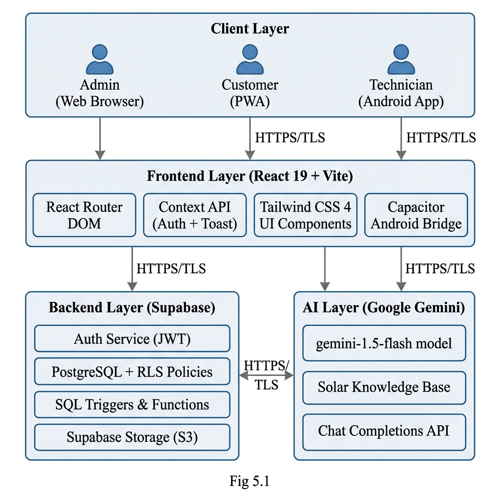
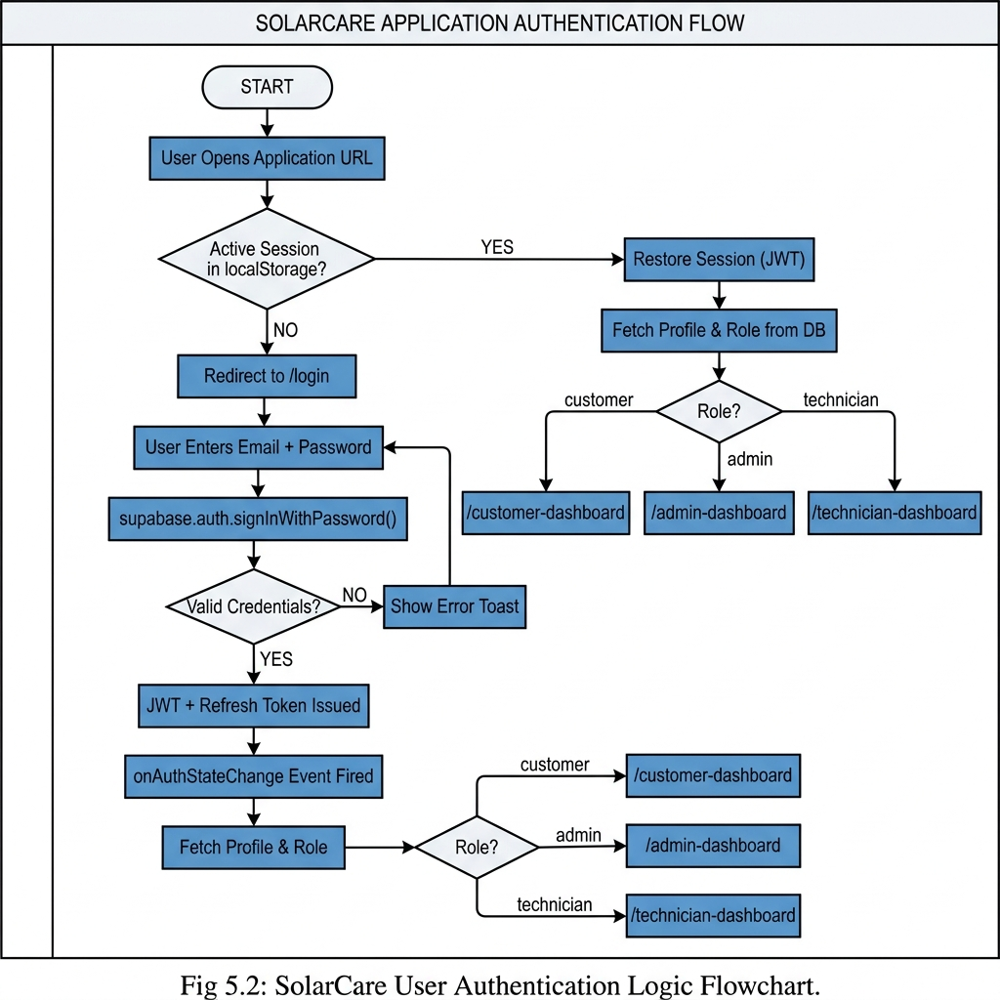
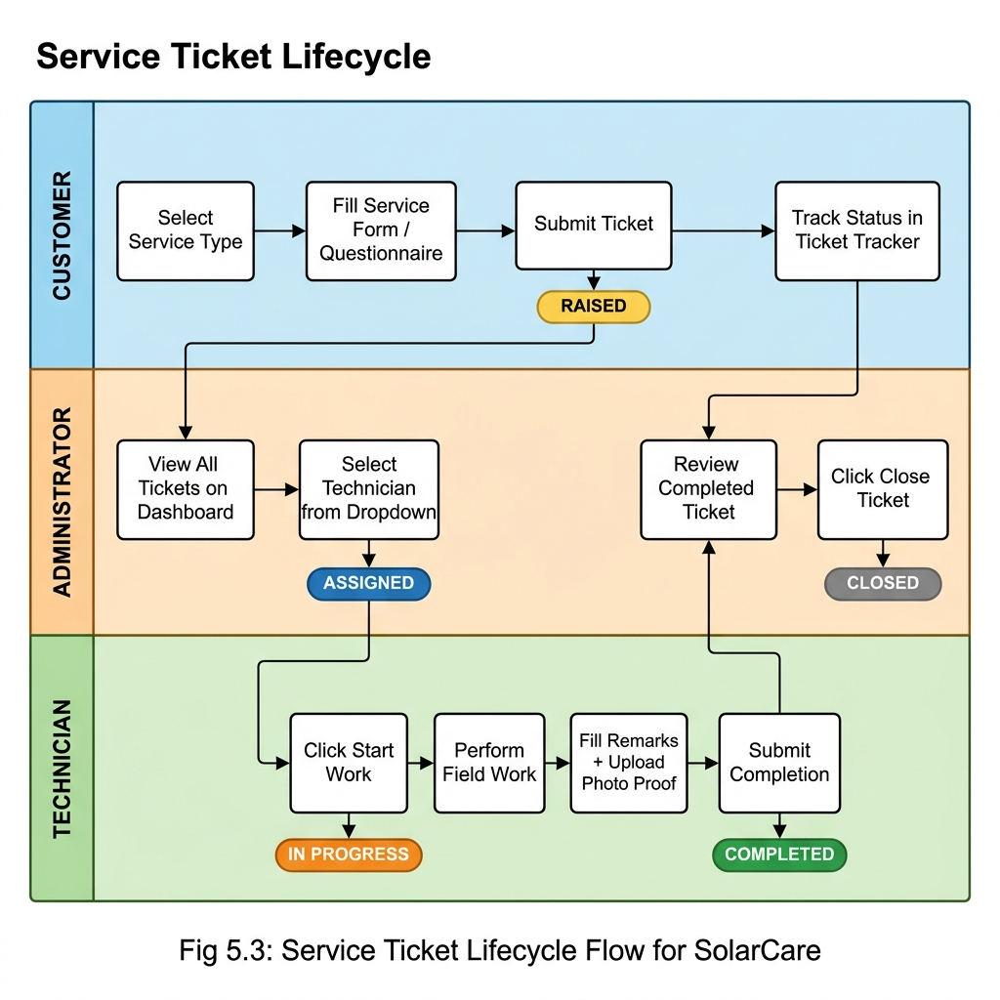
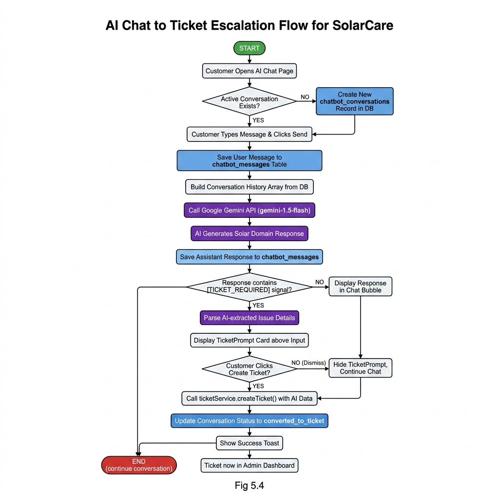
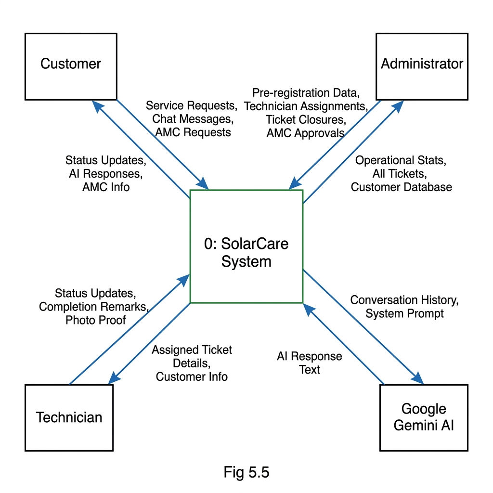
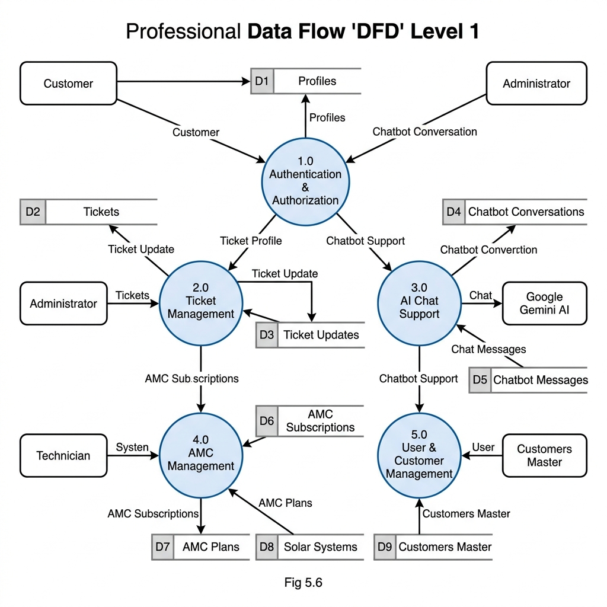
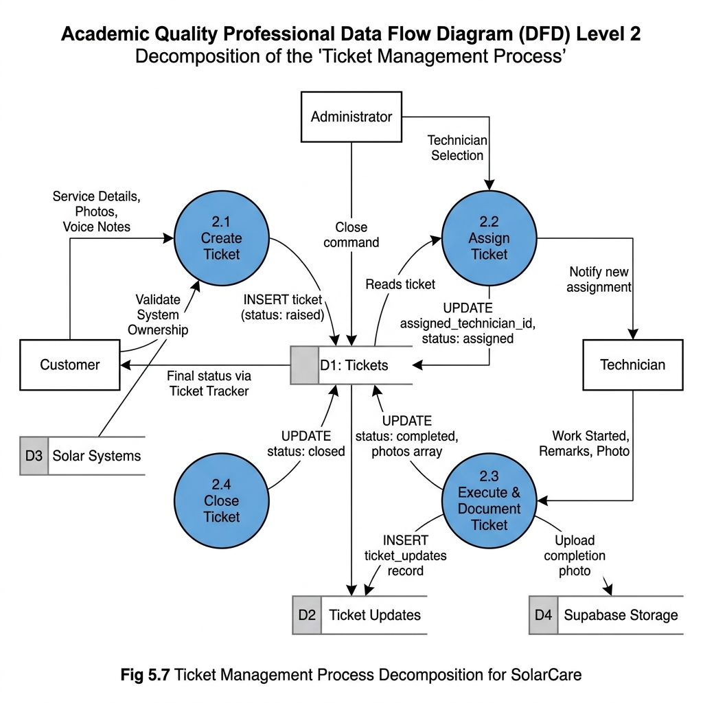
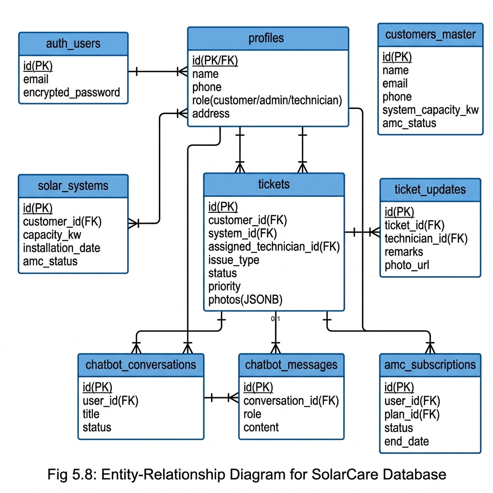
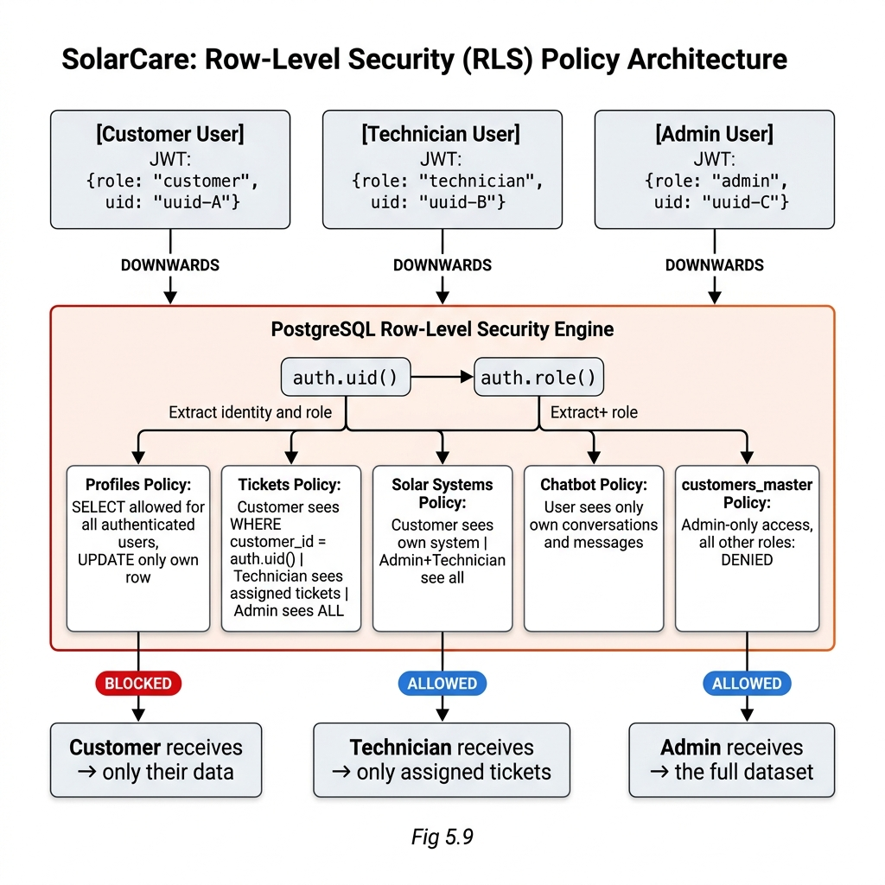
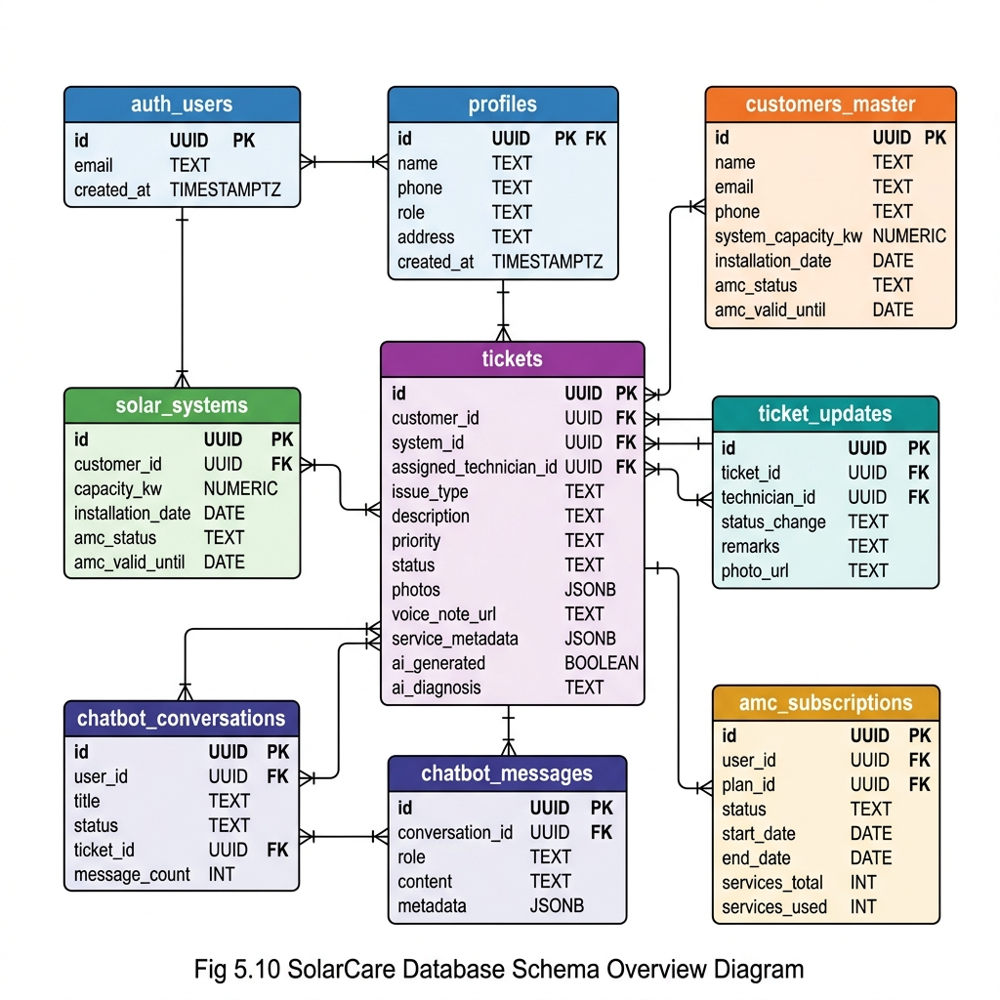

# SolarCare – All Figures and Diagrams
### Chapter 5: System Design Diagrams

All images are located in the `figures/` folder inside your project directory.

---

## Fig 5.1 – System Architecture Diagram

**Figure 5.1:** The SolarCare System Architecture showing the four-layered model — Client Layer (Admin, Customer, Technician), Frontend Layer (React 19 + Vite + Capacitor), Backend Layer (Supabase: Auth, PostgreSQL, Storage), and AI Layer (Google Gemini). All communication occurs over HTTPS/TLS.

---

## Fig 5.2 – User Authentication Flowchart

**Figure 5.2:** The User Authentication Flow showing session restoration via localStorage JWT check, login validation via supabase.auth.signInWithPassword(), JWT and refresh token issuance, profile/role fetch from DB, and role-based dashboard redirection for Customer, Admin, and Technician users.

---

## Fig 5.3 – Service Ticket Lifecycle Flowchart

**Figure 5.3:** Service Ticket Lifecycle Swimlane across three roles. Customer lane: service selection to status tracking. Administrator lane: ticket review to closure. Technician lane: assignment acceptance to completion with photo proof. Status progression: RAISED → ASSIGNED → IN PROGRESS → COMPLETED → CLOSED.

---

## Fig 5.4 – AI Chat to Ticket Escalation Flowchart

**Figure 5.4:** AI Chat to Service Ticket Escalation Flow — from customer message entry through Gemini API invocation with full conversation history, TICKET_REQUIRED signal detection, TicketPrompt display, and final ticket creation with conversation status updated to converted_to_ticket.

---

## Fig 5.5 – DFD Level 0: Context Diagram

**Figure 5.5:** Data Flow Diagram Level 0 (Context Diagram) for SolarCare. Shows the entire system as a single process with four external entities: Customer, Administrator, Technician, and Google Gemini AI, with all major labeled data flows between them and the system.

---

## Fig 5.6 – DFD Level 1: Main Processes

**Figure 5.6:** DFD Level 1 decomposing SolarCare into five core processes: (1.0) Authentication and Authorization, (2.0) Ticket Management, (3.0) AI Chat Support, (4.0) AMC Management, and (5.0) User and Customer Management, with all nine data stores D1–D9 and their data flows.

---

## Fig 5.7 – DFD Level 2: Ticket Management Sub-Processes

**Figure 5.7:** DFD Level 2 decomposition of Ticket Management (2.0) into four sub-processes: (2.1) Create Ticket, (2.2) Assign Ticket, (2.3) Execute and Document Ticket, and (2.4) Close Ticket, with data stores for Tickets, Ticket Updates, Solar Systems, and Supabase Storage.

---

## Fig 5.8 – Entity-Relationship (ER) Diagram

**Figure 5.8:** Entity-Relationship Diagram for SolarCare showing all 9 entities with primary keys, foreign keys, and key attributes. Crow's foot notation shows cardinalities: auth_users 1:1 profiles, profiles 1:N solar_systems, profiles 1:N tickets, tickets 1:N ticket_updates, profiles 1:N chatbot_conversations, chatbot_conversations 1:N chatbot_messages.

---

## Fig 5.9 – Row-Level Security (RLS) Policy Architecture

**Figure 5.9:** Row-Level Security Policy Architecture showing how the PostgreSQL RLS engine extracts user identity from the JWT via auth.uid() and applies role-specific policies. Red BLOCKED indicators show filtered unauthorized access attempts; green ALLOWED shows authorized data paths for Customer, Technician, and Admin roles.

---

## Fig 5.10 – Database Schema Overview (9 Tables)

**Figure 5.10:** Complete Database Schema Overview showing all 9 tables with column names, data types, and PK/FK designations. Color-coded headers: blue (auth/profiles), orange (customers_master), green (solar_systems), purple (tickets), teal (ticket_updates), indigo (chatbot tables), amber (amc_subscriptions). FK relationship lines show referential integrity constraints.

---

## Summary Table – List of All Figures

| Fig No. | Description | Chapter |
|---|---|---|
| Fig 5.1 | System Architecture Diagram | Ch. 5 |
| Fig 5.2 | User Authentication Flowchart | Ch. 5 |
| Fig 5.3 | Service Ticket Lifecycle Swimlane Flowchart | Ch. 5 |
| Fig 5.4 | AI Chat to Ticket Escalation Flowchart | Ch. 5 |
| Fig 5.5 | DFD Level 0 – Context Diagram | Ch. 5 |
| Fig 5.6 | DFD Level 1 – Main Processes | Ch. 5 |
| Fig 5.7 | DFD Level 2 – Ticket Management Sub-Processes | Ch. 5 |
| Fig 5.8 | Entity-Relationship (ER) Diagram | Ch. 5 |
| Fig 5.9 | Row-Level Security Policy Architecture | Ch. 5 |
| Fig 5.10 | Database Schema Overview (9 Tables) | Ch. 5 |
| Fig 8.1.1 | Screenshot: Login Page | Ch. 8 |
| Fig 8.1.2 | Screenshot: Customer Dashboard | Ch. 8 |
| Fig 8.1.3 | Screenshot: Services Page | Ch. 8 |
| Fig 8.1.4 | Screenshot: AI Chat with Ticket Prompt | Ch. 8 |
| Fig 8.1.5 | Screenshot: Ticket Tracker | Ch. 8 |
| Fig 8.1.6 | Screenshot: AMC Shop with AI Recommendation | Ch. 8 |
| Fig 8.1.7 | Screenshot: Admin Tickets Tab | Ch. 8 |
| Fig 8.1.8 | Screenshot: Admin Verification Tab | Ch. 8 |
| Fig 8.1.9 | Screenshot: Technician Dashboard | Ch. 8 |
| Fig 8.1.10 | Screenshot: Technician Completion Form | Ch. 8 |
| Fig 8.1.11 | Screenshot: Multilingual Interface (Marathi) | Ch. 8 |
| Fig 8.1.12 | Screenshot: Admin User Management Tab | Ch. 8 |
