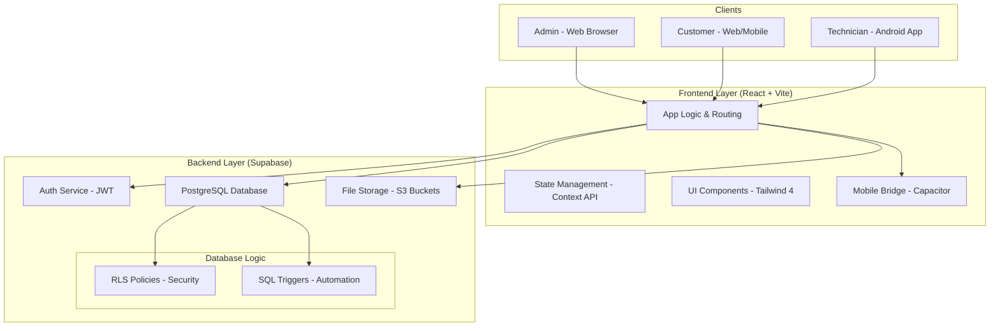

# SolarCare System Architecture

The SolarCare platform follows a **Modern Serverless Architecture**, leveraging a high-performance React frontend and a powerful "Backend-as-a-Service" (BaaS) via Supabase.

## 📐 Architecture Diagram

## 🧩 Component Breakdown

### 1. Frontend Layer (The Experience)
*   **React 19 & Vite**: The application logic is centralized in a modern single-page application (SPA). Vite provides the build optimization essential for fast loading on mobile networks.
*   **Capacitor**: Acts as a "bridge" that allows the web code to run as a native Android application, providing access to hardware features like the camera (for service photos).
*   **Tailwind CSS 4**: A utility-first styling layer that ensures the UI is responsive across small phone screens and large admin monitors.

### 2. Security Layer (Identity & Access)
*   **Supabase Auth**: Manages the entire lifecycle of a user session. It issues JSON Web Tokens (JWT) that are sent with every database request.
*   **Row-Level Security (RLS)**: This is the most crucial architectural choice. Instead of having a server filter data, the **Database itself** checks the user's role and ID to determine which rows they can see or edit.

### 3. Database Layer (The Intelligence)
*   **PostgreSQL**: A robust relational database that stores everything from customer records to fine-grained service logs.
*   **SQL Triggers**: These are small "listeners" that automatically perform tasks. For example, when a new user signs up, a trigger automatically checks the `customers_master` table and attaches their system information without any manual intervention.

### 4. Media Layer (Storage)
*   **Supabase Storage**: A dedicated bucket system for handling non-relational data like technician-uploaded photos. Each image is logically linked back to a ticket update via a URL reference.

## 🚀 Data Flow: Raising a Service Ticket
1.  **Request**: A **Customer** submits a ticket via the UI.
2.  **Validation**: The **Auth Token** is sent to Supabase. **RLS** confirms the customer owns the system.
3.  **Persistence**: The ticket is saved to the `tickets` table.
4.  **Notification**: An **Admin** dashboard refetches data (or uses real-time subscriptions) and sees the new ticket.
5.  **Assignment**: The Admin assigns a **Technician**.
6.  **Field Work**: The Technician opens their **Android App**, sees the assigned ticket, performs the work, and uploads a photo directly to **Storage**.
